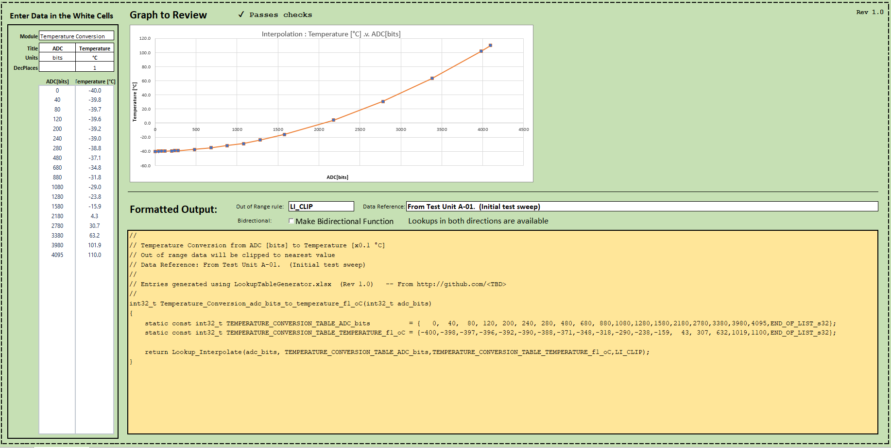

# Collection #

This collection is a repository for miscellanous libraries and utilities that have been generated over the years.

They are geared towards C on embedded devices

The source code here is often just merged into other utility functions - they are separated here for convenience

## Lookup With Interpolate ##

Basic lookup table with interpolation/extrapolation, scaling, etc

Used for integer based embedded systems so supports scaling (such as returning data in multiples of 0.1 °C).

An Excel spreadsheet is provided to simply generate lookup tables as needed.

* [Lookup_WithInterpolate.h](./src/Lookup_WithInterpolate.h)
* [Lookup_WithInterpolate.c](./src/Lookup_WithInterpolate.c)
* [LookupTableGenerator.xlsx](./doco_and_tools/LookupTableGenerator.xlsx) -- Protection password is just 'mac'

